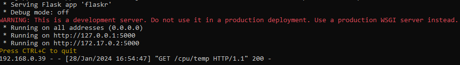
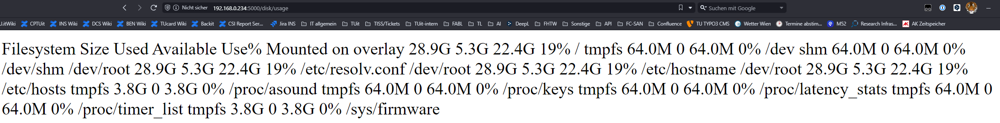
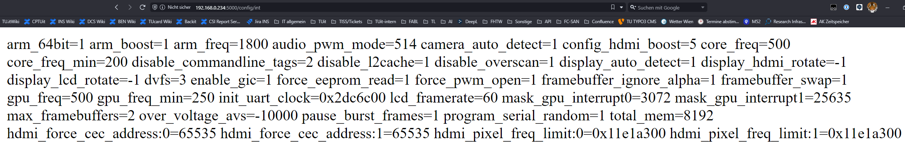
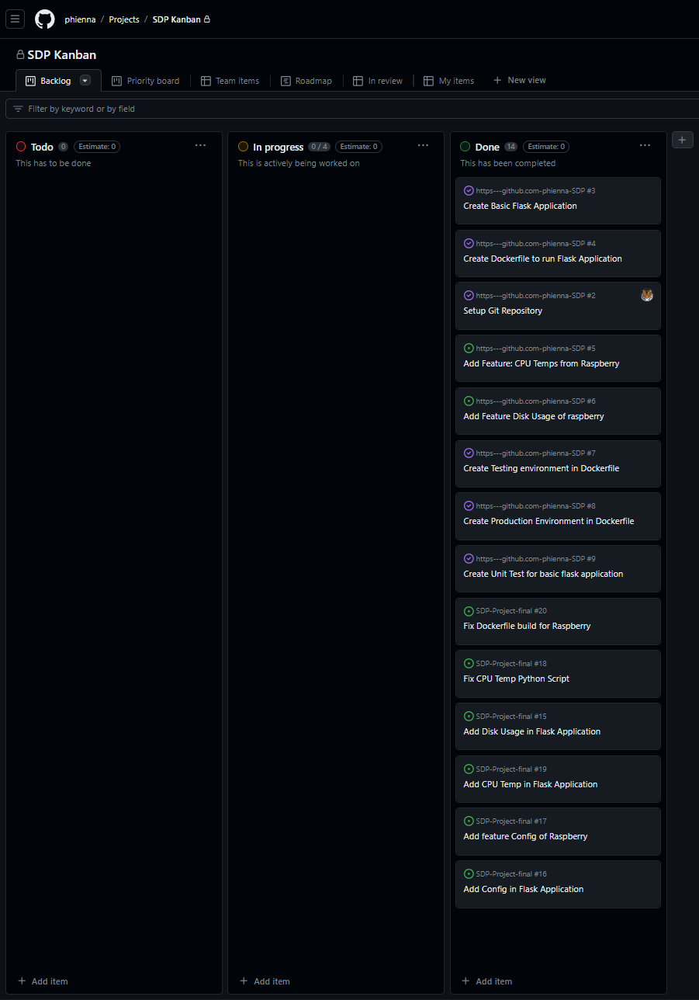

# Finale Abgabe

Bearbeitet von: Bernhard Monschiebl mio22m024, Christiane Philipp mio22m026

## Letzte Projektphase

### Veränderte Dateien

* Folder flaskr/service:
  * `__init__.py`
  * `hardware.py`
* Folder flaskr/view:
  * `cpu.py`
  * `disk.py`
  * `config.py`
* Folder test:
  * `conftest.py`
  * `test_cpu.py`
  * `test_disk.py`
  * `test_config.py`

### Ausgeführtes Resultat

Containerstart mit gemoutetem Device:

CPU Temperatur

Disk Usage

Configuration

### Projektabschluss

Zusätzlich zur Aufgabenstellung wurde noch die Funktionalität "config" hinzugefügt.

### Github-Repository

* github: <https://github.com/phienna/SDP-Project-final>
* dockerhub: <https://hub.docker.com/r/phienna/flask-mio>
